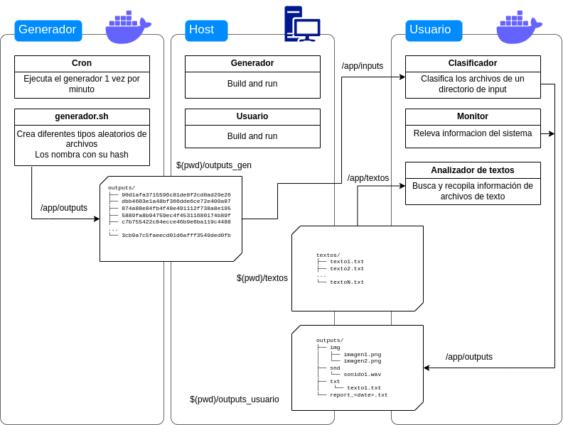

# Trabajo Práctico EDP Recursado - 2023

En este trabajo práctico se desarrollarán las siguientes funcionalidades:
* Generador de archivos: Podrá generar archivos de texto, imágenes y sonidos.
* Clasificador de archivos: Ordenará los archivos según su tipo.
* Monitor del sistema: Reportará variables del uso del sistema (espacio libre en disco, uso de RAM, uso de CPU, número de procesos corriendo en el sistema)
* Analizador de texto: Buscará patrones en archivos de texto, palíndromos, direcciones de email, etc.

A su vez, estas funcionalidades se dividirán en dos módulos:
* Módulo Generador: Genera periódicamente archivos en los distintos formatos.
* Módulo Usuario:
    * Provee un menú para elegir entre las distintas funcionalidades interactivamente.
    * Se encarga de clasificar los archivos que se encuentren en un directorio específico. 
    * Monitorea la información de sistema del container.
    * Analiza los textos.

## Diagrama arquitectura final



## Módulo Generador

### Generador de archivos

El generador de archivos deberá ser capaz de generar a pedido distintos tipo de archivos:

#### Texto:
```
base64 /dev/urandom | head -c 500 > file.txt
```
(Traer textos de ejemplo de alguna parte para que el analizador de textos tenga algún input más definido)

#### Sonidos:
```
ffmpeg -f lavfi -i "anoisesrc=a=0.1:c=white:duration=5" out.wav
```

#### Imágenes:
```
convert -size 100x100 xc: +noise Random noise.png
```

### Timer/cron

Definir una tarea recurrente (cada 1 min) que genere un archivo aleatorio con el generador de archivos (no sabemos que tipo de archivo se va a generar).

> Nota: Es complejo configurar systemd en un docker ya que el kernel es compartido entre host y contenedor. Usar **crond** en este caso.

A su vez, deberá calcular el hash del archivo generado y renombrarlo con el mismo. Los archivos generados deberán ser guardados en un volumen de docker compartido con el Módulo Usuario.

```
outputs/
├── 90d1afa3715596c81de8f2cd0ad29e26
├── dbb4603e1a48bf366dde6ce72e400a87
├── 874a88e84fb4f48e491112f738a8e195
├── 5889fa8b94759ec4f45311680174b89f
├── c7b755422c84ecce46b9e6ba119c4488
...
└── 3cb9a7c5faeecd01d6afff3549ded0fb
```

>Nota: Los archivos solo se nombran con su hash, no conocemos las extensiones de los mismos.

## Módulo Usuario

### Clasificador de archivos

Recibe una ruta específica con archivos y los clasifica de acuerdo a la siguiente estructura de archivos:
```
outputs/
├── img
│   ├── imagen1.png
│   └── imagen2.png
├── snd
│   └── sonido1.wav
└── txt
    └── texto1.txt
```
Para ello deberá verificar que tipo de archivo recibe usando el comando `file` y moverlo a la carpeta que corresponda. También deberá renombrarlo como`<tipodearchivo><N>.<extension>` como se ve en la estructura más arriba.

### Compresor

Una vez que todos los archivos están clasificados, generar un `.tar` del directorio outputs para compartirlo luego y poder ser accedido desde afuera del contenedor.

### Monitor

Deberá reportar datos de:
* Uso de CPU
* Uso de RAM
* Nro de procesos corriendo en el sistema
* Espacio libre en el disco (o porcentaje de uso)

Guardar este reporte en `outputs/report_<DD_MM_YY:HH_MM_SS>.txt`

### Analizador de Textos

Deberá recibir un archivo de texto de entrada y poder efectuar diferentes análisis del mismo. Hacer un submenú que tenga las siguientes opciones:
* `statsWords.sh`: Indicador estadístico de longitud de palabras (la más corta, la más larga y el promedio de longitud).
* `palindromeDetection.sh`: Mostrar palabras palíndromo (ignorar mayúsculas/minúsculas y acentos en este caso). Ejemplos: Neuquén, radar, reconocer
* `mailAddressDetection.sh`: Detectar y listar las direcciones de mail encontradas dentro del texto, ordenarlas y evitar repeticiones. Ejemplo: `nombre@dominio.com`. `Ayuda: utilizar una expresión regular.`

Como se ve en el diagrama, el analizador de textos deberá recibir una ruta a algún archivo de texto (`textoN.txt`) (Ayuda: pedirle la ruta al usuario) y realizar el análisis en él.

>AYUDA: Montar un volumen en el contenedor de usuario en /app/textos para poder acceder a los archivos a analizar.

Un texto de ejemplo podría ser:
`texto1.txt`
```
En un pequeño rincón del universo, donde las palabras danzan entre las estrellas, se encuentra un lugar mágico lleno de palíndromos y secretos. Neuquén, con sus montañas que abrazan el cielo, guarda historias que solo los más curiosos pueden descubrir.

Había una vez un radar que guiaba a los viajeros perdidos por caminos inexplorados. Reconocer sus señales era clave para aventurarse más allá de la superficie. Mientras tanto, en una palapa encantada, aviva la llama de la imaginación y la creatividad.

En esta tierra de maravillas, anita lava la tina de los recuerdos, recordando días llenos de risas y sueños. Pero cuidado, como el oso que acecha en la penumbra, hay desafíos que solo los valientes pueden enfrentar.

Direcciones de correo electrónico se entrelazan como hilos invisibles en esta narrativa cósmica. Juan@example.com, un explorador moderno, se comunica con María.doe@email.com para intercambiar experiencias. Mientras tanto, info@empresa.com guarda los secretos de un proyecto revolucionario, y otrocorreo@gmail.com espera en la sombra.

A medida que el viento susurra entre las hojas de la ventana del tiempo, seres extraordinarios se reúnen para debatir sobre el destino de la existencia. El nivel de sabiduría se eleva como un globo en el cielo estrellado, guiando a aquellos que buscan respuestas.

En este cuento de palabras y direcciones, la computadora cósmica procesa la información del cosmos. La elefante curiosa observa desde la distancia, mientras el correo electrónico, como un mensajero del más allá, conecta mundos distantes.

Y así concluye esta historia, tejida con las hebras de la realidad y la fantasía. Que este texto sea un faro para aquellos que buscan el significado oculto entre las líneas y las direcciones de un viaje sin fin.

Fin del relato.

```

Los resultados de los análisis deberán mostrarse por consola.

### Menú

Consultar al usuario que quiere hacer:
* Procesar archivos: Descarga, clasificación, archivo comprimido.
* Monitoreo del sistema: Generar reporte del sistema.
* Analizador de textos: Submenú con las diferentes opciones definidas arriba.

## Dockers

Todos los módulos pueden y **deben** ser dockerizados sin problemas.

```
FIN DEL ENUNCIADO
```

# Propuesta de etapas de desarrollo

1. Implementar el generador de archivos
2. Implementar el clasificador de archivos
3. Implementar el cron para generar archivos aleatorios cada minuto
4. Implementar el monitor del sistema
5. Implementar el analizador de textos
6. Dockerizar todo

# Opcionales!

1. El generador de archivos puede generar muchas cosas, por ejemplo podríamos cambiar los tipos de onda que se usan para generar los sonidos o los tipos de ruido que usamos para generar las imágenes. Experimentar con los distintos tipos, extender los scripts para poder indicarle estas opciones.
2. Agregar otras stats del sistema de interés (temperatura de los procesadores, uso de memoria swap, cantidad de procesos del usuario, etc).
3. Buscar otros patrones o info de interés en los textos, como cantidad de palabras, sustantivos propios, números telefónicos, etc.
